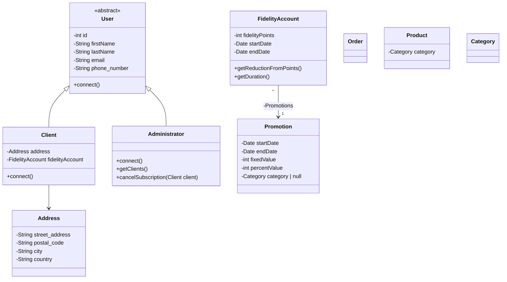

# Class Diagram

```mermaid
classDiagram
    User <|-- Client
    User <|-- Administrator
    Client --> Address
    FidelityAccount "*" --> "1" Promotion : -Promotions
    
    class User{
        <<abstract>>
        -int id
        -String firstName
        -String lastName
        -String email
        -String phone_number
        +connect()
    }
    
    class Client{
        -Address address
        -FidelityAccount fidelityAccount
        +connect()
    }
    
    class Administrator{
        +connect()
        +getClients()
        +cancelSubscription(Client client)
    }
    
    class Address{
        -String street_address
        -String postal_code
        -String city
        -String country
    }
    
    class Order{
        
    }
    
    class FidelityAccount{
        -int fidelityPoints
        -Date startDate
        -Date endDate
        +getReductionFromPoints()
        +getDuration()
    }
    
    class Promotion{
        -Date startDate
        -Date endDate
        -int fixedValue
        -int percentValue
        -Category category | null
    }
    
    class Product{
        -Category category
        
    }
    
    class Category{
        
    }
    
    
```

A voir pour les modérateurs plus tard si on a le temps.
