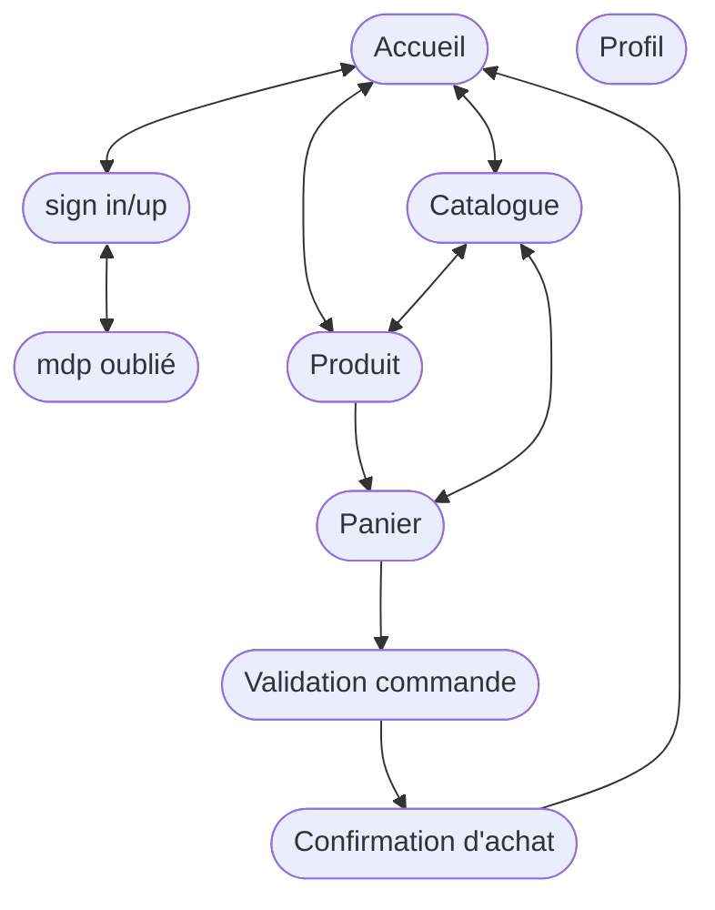
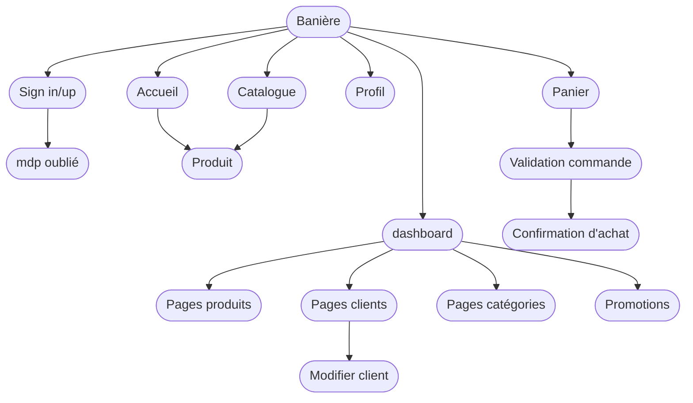

# Pages Diagram

## Admin

Liste des parties
- Clients
  - lister
  - gérer les droits / avantages
  - ajouter / supprimer
- catalogue
  - lister
  - ajouter
  - supprimer
  - modifier
- catégories
  - ajouter
  - supprimer
  - modifier

Programme par palier
