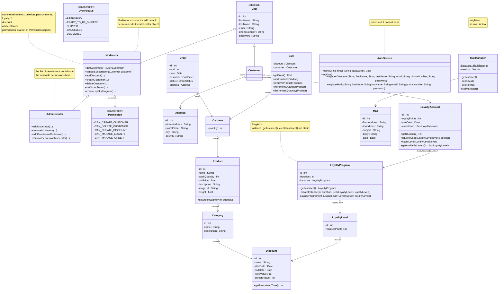

# Class Diagram

```mermaid
classDiagram
    User <|-- Customer
    User <|-- Moderator
    Moderator <|-- Administrator
    Moderator "-permissions" o--> "*" Permission
    Customer "-address" o--> Address
    Customer "-loyaltyAccount" o--> LoyaltyAccount
    Product "-category" o--> Category
    LoyaltyAccount "<u>-loyaltyProgram {readOnly}</u>" o--> LoyaltyProgram
    LoyaltyProgram "<u>-loyaltyLevels</u>" o--> "*" LoyaltyLevel
    Category "-discount" o--> Discount
    CartItem "-product" o--> Product
    LoyaltyLevel "-discount" o--> Discount
    Order "-items" o--> "*" CartItem
    Cart "-items" o--> "*" CartItem
    MailManager --> Mail
    
    note for AuthService "return null if doesn't exist"
    note for Moderator "comments/reviews : deletion, pin comments...
        loyalty ?
        discount
        add customer
        permissions is a Set of Permission objects"
    note for LoyaltyProgram "Singleton
        instance, getInstance(), createInstance() are static"
    note for Administrator "the list of permissions contains all
     the available permissions here"

    class User{
        <<abstract>>
        -id : int
        -firstName : String
        -lastName : String
        -email : String
        -phoneNumber : String
        -password : String
    }
    
    class Customer{ }
    
    class Administrator{
        +addModerator(...)
        +removeModerator(...)
        +addPermissionModerator(...)
        +removePermissionModerator(...)
    }
    
    note for Moderator "Moderator constructor add default
    permissions to the Moderator object"
    
    class Moderator {
        +getCustomers() List~Customer~
        +cancelSubscription(Customer customer)
        +addDiscount(...)
        +createCustomer(...)
        +deleteCustomer(...)
        +setOrderStatus(...)
        +createLoyaltyProgram(...)
    }
    
    class Permission {
        <<enumeration>>
        +CAN_CREATE_CUSTOMER
        +CAN_DELETE_CUSTOMER
        +CAN_CREATE_DISCOUNT
        +CAN_MANAGE_LOYALTY 
        +CAN_MANAGE_ORDER
    }
    
    class AuthService{
        +logIn(String email, String password) User
        +logOut()
        +registerCustomer(String firstName, String lastName, String email, String phoneNumber, String password)
        +registerModo(String firstName, String lastName, String email, String phoneNumber, String password)
    }
    
    class Address{
        -id : int
        -streetAddress : String
        -postalCode : String
        -city : String
        -country : String
    }
    
    class LoyaltyAccount{
        -id : int
        -loyaltyPoints : int
        -startDate : Date
        -levelsUsed : Set~LoyaltyLevel~
        +getDuration() int
        +isLevelUsed(LoyaltyLevel level) boolean
        +claimLevel(LoyaltyLevel level)
        +getAvailableLevels() List~LoyaltyLevel~
    }
    
    class LoyaltyLevel{
        -id : int
        -requiredPoints : int
    }
    
    class LoyaltyProgram{
        -id : int
        -duration : int
        -instance : LoyaltyProgram
        +getInstance() LoyaltyProgram
        +createInstance(int duration, Set~LoyaltyLevel~ loyaltyLevels)
        -LoyaltyProgram(int duration, Set~LoyaltyLevel~ loyaltyLevels)
    }
    
    class Discount{
        -id : int
        -name : String
        -startDate : Date
        -endDate : Date
        -fixedValue : int
        -percentValue : int
        +getRemainingTime()  int
    }
    
    class Product{
        -id : int
        -name : String
        -stockQuantity : int
        -unitPrice : float
        -description : String
        -imageUrl : String
        -weight : float
        +setStockQuantity(int quantity)
    }
    
    class Category{
        id : int
        name : String
        description : String
    }

    class CartItem {
        -quantity : int
    }
    
    class Cart {
        -discount : Discount
        -customer : Customer
        +getTotal() float
        +addProduct(Product)
        +removeProduct(Product)
        +incrementQuantity(Product)
        +decrementQuantity(Product)
    }
    
    class Order {
        -id : int
        -total : int
        -date : Date
        -customer : Customer
        -status : OrderStatus
        -address : Address
    }
    
    class OrderStatus {
       <<enumeration>>
       +PREPARING
       +READY_TO_BE_SHIPPED
       +SHIPPED
       +CANCELLED
       +DELIVERED
    }
    
    class Mail {
        -id : int
        -fromAddress : String
        -toAddress : String
        -subject : String
        -body : String
        -date : Date
    }
    
    note for MailManager "singleton
    session is final"
    class MailManager {
        -instance : MailManager$
        -session : Session
        +getInstance()
        +send(Mail)$
        +delete(Mail)$
        -MailManager()
    }
```