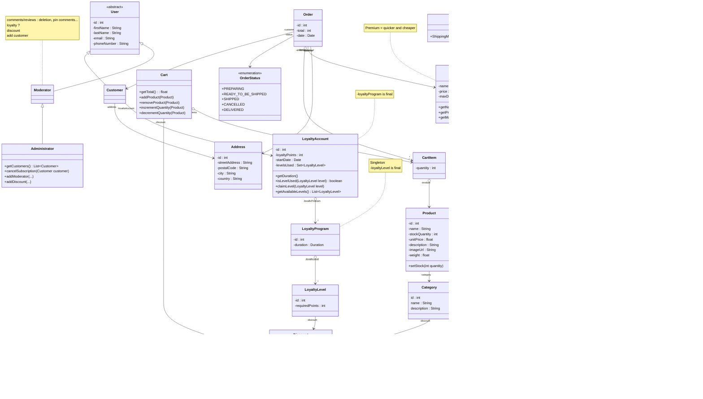

# Class Diagram

```mermaid
classDiagram
    User <|-- Customer
    User <|-- Moderator
    Moderator <|-- Administrator
    Customer "-address" --> Address
    Customer "-loyaltyAccount" --> LoyaltyAccount
    Product "-category" --> Category
    LoyaltyAccount "<u>-loyaltyProgram</u>" o--> "*" LoyaltyProgram
    LoyaltyProgram "<u>-loyaltyLevel</u>" o--> "*" LoyaltyLevel
    Category "-discount" --> Discount
    Cart "-discount" --> Discount
    Cart "-items" o--> "*" CartItem
    CartItem "-product" o--> Product
    LoyaltyLevel "-discount" --> Discount
    Order "-customer" --> Customer
    Order "-status" --> OrderStatus
    Order "-items" o--> "*" CartItem
    Order "-shippingMethod" --> ShippingMethod
    Order "-address" --> Address
    ShippingMethodStandard --|> ShippingMethod
    ShippingMethodPremium --|> ShippingMethod
    
    note for AuthService "return null if doesn't exist"
    note for Moderator "comments/reviews : deletion, pin comments...
        loyalty ?
        discount
        add customer"
    note for LoyaltyProgram "Singleton
    -loyaltyLevel is final"
    note for LoyaltyAccount "-loyaltyProgram is final"
    note for ShippingMethod "Premium = quicker and cheaper"
    

    class User{
        <<abstract>>
        -id : int
        -firstName : String
        -lastName : String
        -email : String
        -phoneNumber : String
    }
    
    class Customer{ }
    
    class Administrator{
        +getCustomers() List~Customer~
        +cancelSubscription(Customer customer)
        +addModerator(...)
        +addDiscount(...)
    }
    
    class Moderator { }
    
    class AuthService{
        +logIn(String email, String password) User
        +logOut()
        +registerCustomer()
        +registerAdmin()
        +registerModo()
    }
    
    class Address{
        -id : int
        -streetAddress : String
        -postalCode : String
        -city : String
        -country : String
    }
    
    class LoyaltyAccount{
        -id : int
        -loyaltyPoints : int
        -startDate : Date
        -levelsUsed : Set~LoyaltyLevel~
        +getDuration()
        +isLevelUsed(LoyaltyLevel level) boolean
        +claimLevel(LoyaltyLevel level)
        +getAvailableLevels() List~LoyaltyLevel~
    }
    
    class LoyaltyLevel{
        -id : int
        -requiredPoints : int
    }
    
    class LoyaltyProgram{
        -id : int
        -duration : Duration
    }  
    
    class Discount{
        -id : int
        -name : String
        -startDate : Date
        -endDate : Date
        -fixedValue : int
        -percentValue : int
        -category : Category
        +getRemainingTime()  Duration
    }
    
    class Product{
        -id : int
        -name : String
        -stockQuantity : int
        -unitPrice : float
        -description : String
        -imageUrl : String
        -weight : float
        +setStock(int quantity)
    }
    
    class Category{
        id : int
        name : String
        description : String
    }

    class CartItem {
        -quantity : int
    }
    
    class Cart {
        +getTotal() : float
        +addProduct(Product)
        +removeProduct(Product)
        +incrementQuantity(Product)
        +decrementQuantity(Product)
    }
    
    class Order {
        -id : int
        -total : int
        -date : Date
    }
    
    class OrderStatus {
       <<enumeration>>
       +PREPARING
       +READY_TO_BE_SHIPPED
       +SHIPPED
       +CANCELLED
       +DELIVERED
    }
    
    class ShippingMethod {
        <<abstract>>
        -name : String
        -price : int
        -maxDaysTransit : int
        +getName()  String
        +getPrice()  float
        +getMaxDaysTransit()  int
    }
    
    class ShippingMethodPremium {
        +ShippingMethodPremium(String, int, int)
    }

    class ShippingMethodStandard {
        +ShippingMethodStandard(String, int, int)
    }
```

Moderator might (not) be added depending on how much time we have
